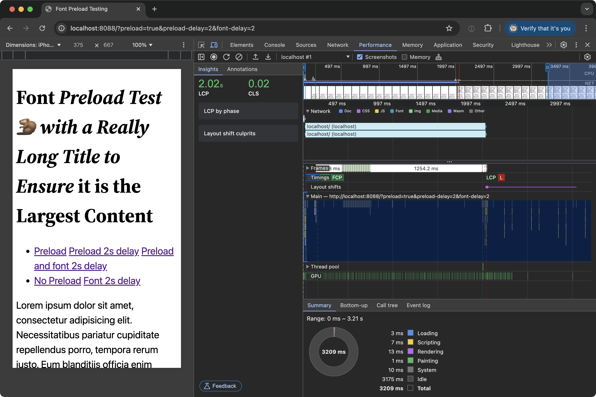

# Perf Bench

Various performance benchmarks for web technologies.

## Font Preload Benchmark

Start the Server:

    docker compose up -d

Visit [localhost:8088](http://localhost:8088) in your browser.

Generate test URL combinations (if the parameters have been modified):

    docker compose exec web php generate.php http://localhost:8088 > font-preload-urls.txt

Run the Web Vitals tests using [WPP Research](https://github.com/GoogleChromeLabs/wpp-research):

    git clone https://github.com/GoogleChromeLabs/wpp-research.git
    cd wpp-research
    nvm use
    npm install
    npm run research benchmark-web-vitals -- --file=../font-preload-urls.txt -n 5 -w mobile -o csv

Note, the test will take a while to complete due to the custom delays in for font preload.